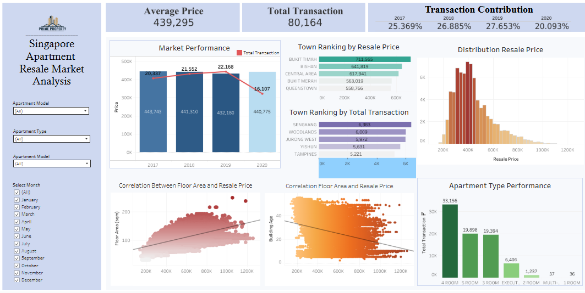

[View Dashboard](https://public.tableau.com/app/profile/hazna.ardeva/viz/DashboardMIlestone2/SingaporeApartmentResaleMarketAnalysisDashboard?publish=yes)
---
# Real Estate Resale Market Analysis

📌 Project Background

A mid-scale property developer needs a data-driven strategy to determine competitive selling prices, identify high-demand regions, and understand which apartment characteristics influence resale value.

This project analyzes 80,374 residential resale transactions (2017–2020) to uncover pricing trends, transaction dynamics, and value drivers that can support strategic sales and pricing decisions.

🎯 Project Objective
- To provide actionable insights regarding:
- Market price trends over time
- High-transaction regions
- Most demanded apartment types
- The impact of building age and floor area on resale price
- Competitive pricing range for 4-room apartments

🛠️ Tools & Technologies
- Python
- Pandas
- NumPy
- Matplotlib
- Seaborn
- Tableau (Interactive Dashboard)

---

**Hazna Dhifa Putri Ardeva**  
Data Analyst Enthusiast | Hactiv8 Bootcamp Student  
🔗 [LinkedIn](https://linkedin.com/in/haznadhifa) | 📧 [Email](mailto:haznadifa123@gmail.com)

Thanks for visiting! Feel free to star ⭐ the repo if you find it useful
